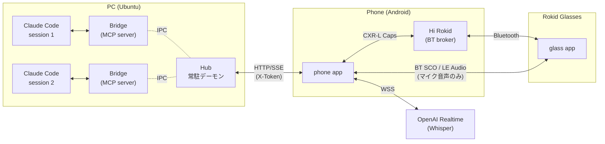

# Claude Mobile HUD

[](https://github.com/TakanariShimbo/claude-mobile-hud/actions/workflows/ci.yml)

> **PC 上で動作する Claude Code を、Phone と Glass で遠隔監視・承認・音声指示できる個人用モバイル操作環境。**

## 概要

Claude Code が 自律的 (Auto Mode / `/goal`) になったぶん、ボトルネックは「AI エージェントの能力」より「人が PC の前にいるか」に寄ってきた。AI が走っているあいだの **確認・承認・指示出し** だけを Phone と Glass に逃がして、PC を離れても、AI を止めない、というのが本プロジェクトの狙い。

- **送る** — Phone からテキスト / 音声 (OpenAI Realtime Whisper、確定前に手編集可能) で進行中の Claude セッションに指示
- **受ける** — Claude の reply が Phone 通知 + Glass に同時配信、Glass はスリープからも自動 wake → セッション画面に遷移
- **承認** — Bash 実行 / ファイル編集等の permission 要求が Phone 通知 + Glass に「拒否 / 許可」付きで届き、どちらからでも verdict 可能
- **並行セッション** — 複数 Claude セッションを同じ Phone から束ねて見れる、Glass でも切替可能

## スコープ

- **PC** — OS を Ubuntu に絞る
- **Phone** — OS を Android (機種不問) に絞る
- **Glass** — Rokid Glasses 専用にする

**Rokid Glasses とは** — [Rokid](https://www.rokid.com/) が 2025-08 に発売した 49g の軽量 AI スマートグラス。両眼 micro-LED waveguide ディスプレイ + フレーム前面カメラを搭載し、Android ベースの独自 OS **YodaOS-Sprite** 上で動作する。外部開発者向けには CXR-L / CXR-M / CXR-S の 3 種類の SDK が公開されており、本プロジェクトは Hi Rokid アプリ拡張のプラグイン型 **CXR-L** (Bluetooth 制御プレーン) を採用している。


_Rokid Glasses 本体 (フレーム前面右にカメラ、テンプル内側に micro-LED 投影モジュール)_

## コンポーネント

- **phone** (Android App): Hub に対する **単一クライアント**。テキスト / 音声 / 画像 / permission 応答 / セッション切替を担当し、必要なら Glass にも中継する
- **glass** (Rokid Glasses App, 任意): Phone と CXR-L (Bluetooth ベースの制御プレーン) で接続。HUD にセッション一覧と reply / permission を表示、ジェスチャで Phone に指示を返す
- **hub** (Ubuntu PC App、常駐デーモン): Phone から見た **単一の HTTP / SSE エンドポイント**。複数の Claude セッションを束ねる中継地点
- **bridge** (Ubuntu PC App、1 セッション = 1 プロセス): Claude Code が `--mcp-config` 経由で spawn する **MCP サーバ**。Hub と IPC で繋がり、reply / permission を双方向に流す
- **`:protocol`** (Kotlin library): phone / glass 間の wire 型定義 (Phase 3 §2 / AD-02)



Glass は Hub に直結させず必ず Phone 経由 (CXR-L) で繋ぐ — N 個の Bridge / 複数セッションが立っても Phone の Hub 接続は HTTP/SSE 1 本に保たれ、Glass 側にも Hub 接続を持たせる必要が無くなる (docs/02-architecture.md AD-01 / AD-02)。

## ディレクトリ構成

```
~/claude-mobile-hud/
├── docs/                       設計書 (01–04)
├── settings.gradle.kts         Gradle root
├── build.gradle.kts
├── gradle.properties
├── gradle/
│   ├── libs.versions.toml      バージョンカタログ
│   └── wrapper/
├── gradlew, gradlew.bat
├── protocol/                   Kotlin library subproject (:protocol)
├── phone/                      Android Phone app (:phone)
├── glass/                      Android Glass app (:glass)
├── cxrglobal/                  git submodule (CXR-L SDK ラッパー)
├── hub/                        Hub (TypeScript, Node)
├── bridge/                     Bridge (TypeScript, Node)
├── claude-mobile-hud           ディスパッチャ CLI
├── tools/
│   ├── verify_atomicity.py     NFR-13 / AC-09 自動検証ランナー
│   └── test_verify_atomicity.py
└── .github/workflows/ci.yml    GitHub Actions CI (protocol / hub / bridge / phone / glass)
```

## 必要環境

### PC (Ubuntu)

- OS: Ubuntu 22.04+
- JDK 21 (Android Studio バンドル JBR を推奨、`JAVA_HOME=/opt/android-studio/jbr`)
- Node.js 22+
- Android SDK (`~/Android/Sdk`)、`adb` / `emulator` はフルパス参照 (PATH 未登録)
- Python 3.10+ (verify_atomicity.py 用)

### Phone (Android)

- PC と adb ペアリング済み (USB / wireless どちらでも)
- Hi Rokid アプリインストール済み (Glass 連携時、CXR-L の BT broker)

### Glass (Rokid Glasses) — 任意

- PC と adb ペアリング済み (USB / wireless どちらでも)
- Hi Rokid 経由で Phone と BT ペアリング済み (CXR-L 接続用)

詳細は [docs/04-setup.md](./docs/04-setup.md) 参照。

## セットアップ

### 1. リポジトリを clone

```bash
git clone --recurse-submodules https://github.com/TakanariShimbo/claude-mobile-hud.git ~/claude-mobile-hud
cd ~/claude-mobile-hud
```

### 2. dispatcher を PATH に通す

CLI (`claude-mobile-hud`) を `$PATH` に通すと作業ディレクトリ問わず叩けて楽。`~/.local/bin` を `$PATH` に入れている前提で symlink:

```bash
mkdir -p ~/.local/bin
ln -s "$(pwd)/claude-mobile-hud" ~/.local/bin/claude-mobile-hud
claude-mobile-hud help   # smoke check
```

### 3. Hub / Bridge セットアップ

```bash
( cd hub    && npm ci && npm run build && npm test )
( cd bridge && npm ci && npm run build && npm test )

# Hub の token を初期化 (.env.example を元に .env を生成 → token を rotate)
cp hub/.env.example hub/.env
claude-mobile-hud rotate-token       # HUB_TOKEN を新規生成 + 書き込み
```

### 4. Claude Code 側の MCP 自動許可

`~/.claude/settings.json` の `permissions.allow` に `mcp__channel__reply` を追加する。これがないと Bridge が Claude に reply を流すたびに permission prompt が出て、Phone 側の verdict が成立しなくなる。

```json
{
    "permissions": {
        "defaultMode": "auto",
        "allow": ["mcp__channel__reply"]
    }
}
```

### 5. Android (Phone + Glass) ビルド

GitHub Release から APK を取得するか、ソースからビルドする。

**Release APK を使う場合** ([Releases](https://github.com/TakanariShimbo/claude-mobile-hud/releases) から最新の `phone-<TAG>-debug.apk` / `glass-<TAG>-debug.apk` をダウンロード):

```bash
ADB=~/Android/Sdk/platform-tools/adb
# <TAG> は Releases ページの最新タグ (例: v1.0.0)
$ADB install -r phone-<TAG>-debug.apk
$ADB install -r glass-<TAG>-debug.apk
```

**ソースからビルドする場合**:

```bash
export JAVA_HOME=/opt/android-studio/jbr
export PATH=$JAVA_HOME/bin:$PATH
./gradlew :protocol:build :protocol:test
./gradlew :phone:assembleDebug :glass:assembleDebug

ADB=~/Android/Sdk/platform-tools/adb
$ADB install -r phone/build/outputs/apk/debug/phone-debug.apk
$ADB install -r glass/build/outputs/apk/debug/glass-debug.apk
```

## 利用フロー

**Hub 常駐 → 初回 pair → run → Phone / Glass で操作** の流れ。

### 1. Hub を常駐起動 (PC)

別ターミナル推奨。`[hub] hub up` が出れば OK。

```bash
claude-mobile-hud hub
```

### 2. (初回のみ) Phone とペアリング (PC)

QR が表示される。

```bash
claude-mobile-hud pair lan           # LAN 経由 (家庭内 Wi-Fi)
claude-mobile-hud pair ts            # Tailscale 経由 (外出先)
```

### 3. Phone / Glass の接続

- **Phone**: アプリの設定ダイアログで「QR で読む」 → ターミナルの QR にカメラを向ける。baseUrl / token が取り込まれて自動で Hub への SSE が張られる
- **Glass** (任意): Phone アプリの目玉アイコン (Visibility) から接続ダイアログ → 「接続」を押すと CXR-L のリンクが張られ、Glass 側アプリが自動起動して HUD にセッション選択画面が出る

### 4. Claude Code セッションを起動 (PC)

作業ディレクトリで:

```bash
cd ~/your-project
claude-mobile-hud run safe           # Permission Relay 有効 (Phone / Glass で verdict)
# or
claude-mobile-hud run yolo           # --dangerously-skip-permissions

# 既存セッション継続
claude-mobile-hud resume             # cwd-scoped picker
claude-mobile-hud list-sessions      # cwd-scoped セッション一覧
```

起動すると Phone のセッション一覧にそのセッションが現れて緑のドット (アクティブ) が付く。

### 5. Phone / Glass から指示を送る

- **Phone (テキスト)**: 入力欄に書いて送信ボタン
- **Phone (音声)**: 設定に OpenAI API key を入れるとマイクボタンが出る。録音中はリアルタイムで文字起こしが入力欄に流れる (確定前に手編集 OK)
- **Glass**: タッチパッドをタップで録音開始 → もう一度タップで停止 → 前後スワイプで「送信」「取消」を選択

### 6. Reply / Permission に対応する

- **Reply**: Phone 通知 + Glass に同時配信。Glass はスリープからも自動 wake → 該当セッション画面に遷移
- **Permission 要求** (Bash 実行 / ファイル編集など): Phone 通知 + Glass に「拒否 / 許可」が同時に出て、どちらからでも verdict 可能

## ドキュメント

| 文書                                                       | 概要                                                                         |
| ---------------------------------------------------------- | ---------------------------------------------------------------------------- |
| [docs/01-requirements.md](./docs/01-requirements.md)       | 機能要件 / 非機能要件 / スコープ / 受け入れ基準                              |
| [docs/02-architecture.md](./docs/02-architecture.md)       | コンポーネント責務 / wire protocol / シーケンス / 横断 ADR                   |
| [docs/03-detailed-design.md](./docs/03-detailed-design.md) | クラス構造 / 状態遷移 / 永続化スキーマ / Phase 4 完了報告 / Phase 5 引き継ぎ |
| [docs/04-setup.md](./docs/04-setup.md)                     | 開発環境セットアップ詳細                                                     |
| [docs/TODO.md](./docs/TODO.md)                             | 持ち越し事項 + Phase 1–6 進捗履歴                                            |
| [CONTRIBUTING.md](./CONTRIBUTING.md)                       | テスト要件 / 開発ワークフロー (PR / Issue 作成手順)                          |
