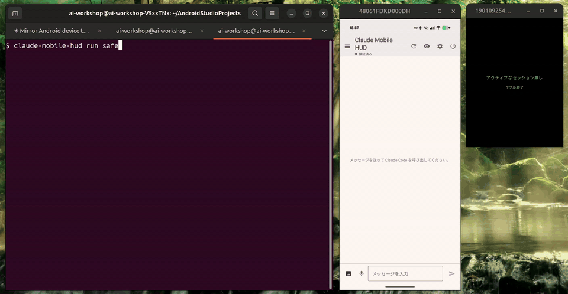
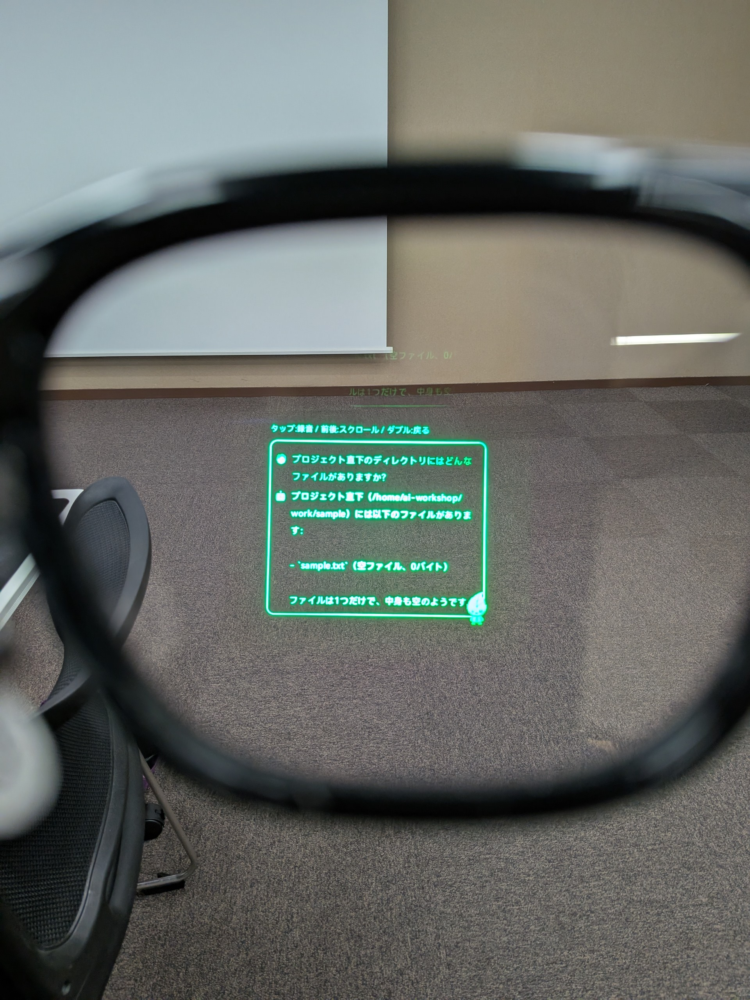
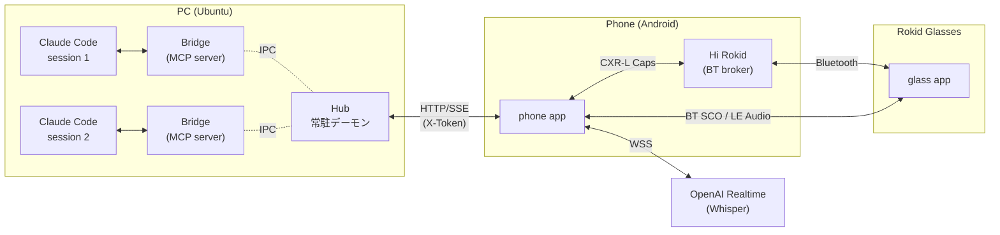
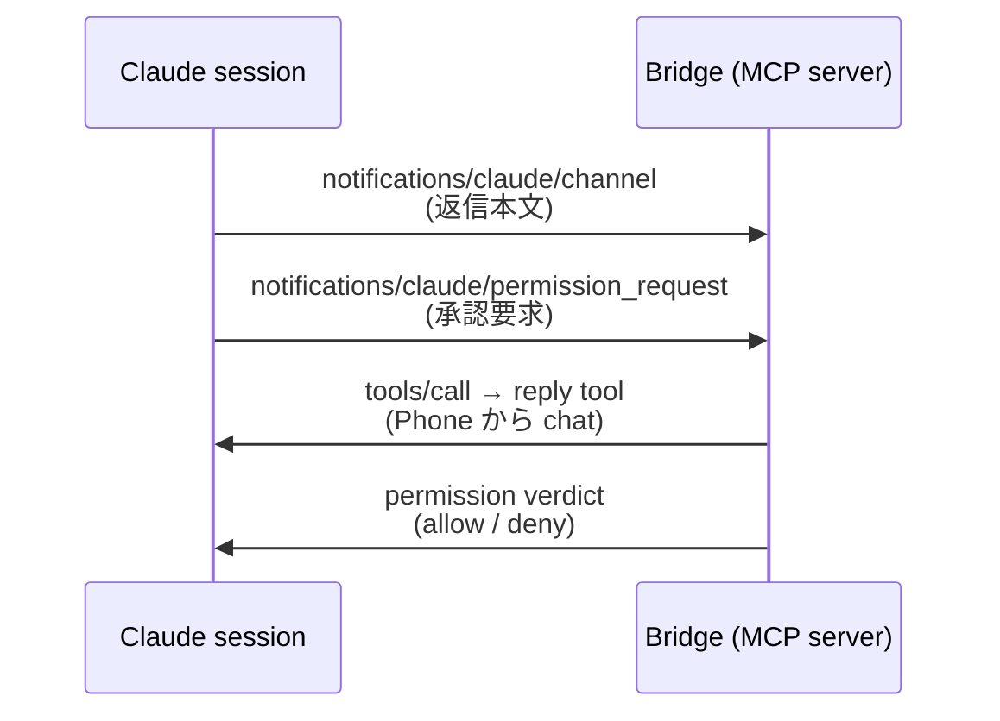
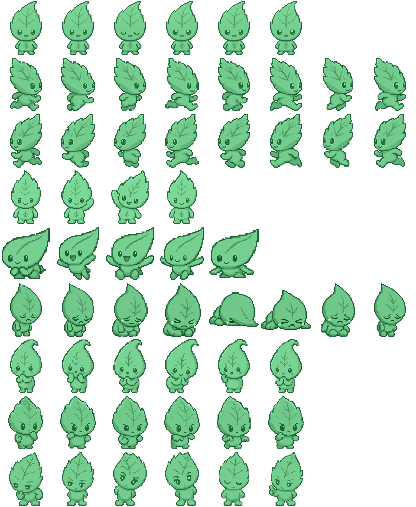

# Claude Code を Phone と Glass からリモートコントロール

## 何をした

Claude Code を使った開発のボトルネックは、もはや AI の能力ではなく **「Claude を人が待たせる時間」** だと感じている。承認の応答、追加指示、返信の確認 — どれも PC の前にいないと進まない。

そこで Phone と Glass から Claude Code をリモート操作できるようにした。

- **PC**: Ubuntu
- **Phone**: Android
- **Glass**: Rokid Glasses

_左: PC ターミナルで `claude-mobile-hud run safe` を起動 / 中央: Phone / 右: Rokid Glasses の HUD。両端末は [scrcpy](https://github.com/Genymobile/scrcpy) で PC にミラーした画面を録画。_

_Rokid Glasses のレンズ越しに撮影した実機ビュー — フレーム中央下に Claude の reply (緑色の HUD) が浮かぶ。_

## なぜ Rokid Glasses か

Rokid Glasses は **両眼ディスプレイ + フロントカメラ + SDK** が揃っている数少ないスマートグラス。**人の五感のうち聴覚と視覚を AI と共有できる** のが大きい。本プロジェクトでは Hi Rokid アプリのプラグイン型 SDK **CXR-L (Bluetooth 制御プレーン)** を使う。

_Rokid Glasses 本体 (フレーム前面右にカメラ、テンプル内側に micro-LED 投影モジュール)_

## 構成

Claude Code は PC で動く。それに Phone からアクセスするために PC 側に **Hub** と **Bridge** という 2 つのプロセスを置いている。

**Hub と Bridge を分けた理由** は、責務がそもそも別だから:

- **Bridge** は **1 Claude セッション = 1 プロセス**。Claude Code が `--mcp-config` で spawn する MCP サーバで、そのセッションの reply / permission をすくい上げる
- **Hub** は **常駐デーモン**。複数の Bridge を束ねて、Phone から見たときに単一の HTTP/SSE エンドポイントとして振る舞う

つまり Claude セッションが何本立ち上がっても、Phone は Hub と HTTP/SSE を 1 本張るだけで済む。Bridge を「セッション単位の寿命」、Hub を「常駐の集約点」と分けることで、Phone 側のクライアント実装を素朴に保てる。

**Glass は Phone と Bluetooth (CXR-L)** で繋がっている。Glass からは Hub に直接アクセスしない。これも、Phone をアプリケーションレイヤの中継地点にすることで Glass 側の実装を軽くするため。

**音声入力は Phone 経由で OpenAI Realtime API (WSS) に繋ぐ**。Glass のマイク音声を Phone が BT で受け取り、そのまま Realtime API に流す。文字起こしはリアルタイムで Phone の入力欄に流れて、確定前に手編集できる。

## 利用フロー

1. PC で Hub を常駐起動
2. (初回のみ) Phone とペアリング (QR を読ませる)
3. 作業ディレクトリで `claude-mobile-hud run safe` を叩く
4. Phone のセッション一覧に新しい Claude セッションが出るので、あとは席を立って Glass / Phone からリモート操作

返信は Phone + Glass に同時配信、承認は両端末から「拒否 / 許可」が選べる。追加指示は Phone のテキスト / 音声、または Glass の音声から送れる。

## 作成談

### Claude Code は Android アプリ開発と相性抜群

Glass も Phone も Android なので、このプロジェクトは Android アプリを書く時間が長いが、**Claude Code は Kotlin + Jetpack Compose + Gradle のスタックで気持ちよく動いてくれた**。Jetpack Compose は React 風の宣言的 UI なので、Android Studio のレイアウトエディタを開かずに `@Composable` を直接書ける。さらに、ビルドからデバッグまでも全部コマンドラインで完結する。そのため、**一連の開発を Claude がやってくれる** — `./gradlew :phone:installDebug` でビルドして実機にインストール、コンパイルエラーが出れば Gradle の出力からそのまま修正、`adb logcat` でクラッシュのスタックトレースを拾って該当行を直接修正。

### Claude セッションとは MCP の Channels で繋いだ

返信を外に出して、外からの追加指示も流す双方向 push が必要だった。ここは Anthropic の研究プレビュー機能 **Channels** に乗っている。MCP の通知メソッドで Bridge と Claude セッションの間に双方向 push を張れて、承認の同期的なやりとりにも自然に乗る。

### Rokid Glasses の SDK を Global 化した

Rokid Glasses をスマホから制御する CXR-L SDK は、当初 **中国市場向けにのみ公開** されていて、Maven Central などの標準経路では取得できなかった。

そこで必要な部分を Global 利用向けに整理して、**`CxrGlobal`** という別リポに切り出した。本プロジェクトからは git submodule (`cxrglobal/`) で参照していて、Phone アプリと Glass アプリの両方が同じ SDK を共有する。

CXR-L を使うアプリを作る際に毎度必要になるので、別リポジトリとして切り出した。

https://github.com/TakanariShimbo/CxrGlobal

### 音声入力は GPT Realtime Whisper を採用

音声入力には OpenAI Realtime API の `gpt-realtime-whisper` を使っている。`wss://api.openai.com/v1/realtime?intent=transcription` に WebSocket を張り、Phone のマイクから 24kHz mono PCM16 を流すと、文字起こしが `*.delta` (途中経過) と `*.completed` (確定) のイベントでリアルタイムに返ってくる。

従来の `whisper-1` (バッチ API) と違って、**録音終了を待たずに発話と同時に文字が流れる**。精度も体感で十分実用レベル。

https://developers.openai.com/api/docs/models/gpt-realtime-whisper

### ペットを Glass に住まわせた

Codex でペットを飼えるようになったのが最近話題になってる。ペットの各状態を縦、動きを横にとった画像を用意することで、自作のペットが作れるらしい。

https://www.youtube.com/watch?v=uO2-G4lrbFc

そこで Glass アプリをペットに対応させると同時に、Codex のスキルを使ってペットを作成してみた — **Konoha** という葉っぱの妖精 —。Codex Pets と共通規格で受け取った画像をもとに、Glass の片隅にペットを召喚し、会話状態 (Idle / Listening / Confirming / Waiting) に合わせてアニメするようにした。実用上は何の役にも立っていないが、視界の隅で Konoha が走り回るのを眺めながら AI と会話するの、地味に楽しい。

_Codex で生成した Konoha のスプライトシート。8 種類の状態 × 各フレームが並んでいて、Glass 側では Compose の Canvas + drawImage で再生している。_

## まとめ

Claude Code が自律になっても、人間の役割が「確認・承認・追加指示」に置き換わるだけで、PC からの解放にはならない。本プロジェクトはその I/O だけを Phone + Rokid Glasses に逃がす試み。

**「視界の隅に reply が流れる」** のは想像以上に良かった。Phone をポケットから出さずに済む時間が増えたぶん、別の作業に集中できる時間が長くなる。
